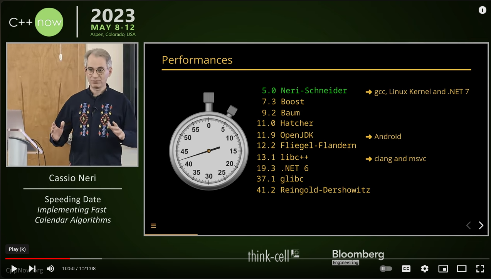

# EAF

This repository contains the supplementary material to:

Neri C, Schneider L. "*Euclidean affine functions and their application
to calendar algorithms*". Softw Pract Exper. 2022;1-34. doi: [10.1002/spe.3172](https://onlinelibrary.wiley.com/doi/full/10.1002/spe.3172).

In particular, it contains instructions on how to build the code and the
article's errata.

This work has been presented at [C++ Now 2023](https://www.youtube.com/watch?v=0s9F4QWAl-E) and
[C++ on Sea 2023](https://www.youtube.com/watch?v=J9KijLyP-yg).
[](https://www.youtube.com/watch?v=0s9F4QWAl-E)

## Table of Contents

**[Building with CMake](#building-with-cmake)**<br>

  * **[Command line](#command-line)**
  * **[Visual Studio IDE](#visual-studio-ide)**

**[Executables](#executables)**<br>
**[Dependencies](#dependencies)**<br>
**[Assembly snippets shown in the paper](#assembly-snippets-shown-in-the-paper)**<br>
**[Other implementations](#other-implementations)**<br>
**[Errata](#errata)**<br>


# Building with CMake

A list of CMakePresets is available. For instance, on Linux the preset
`gcc.debug.make` builds in `debug` mode using `gcc` and `make`. On Windows
`msvc.debug.ninja` builds in `debug` mode using `msvc` and `ninja`. In general,
preset names have the form *compiler*.*mode*.*builder* where

* *compiler* is one of `clang` (Linux), `clang-cl` (Windows), gcc (Linux) or
`msvc` (Windows);
* *mode* is one of `debug`, `release` or `release-symbols`;
* *builder* is one of `make` (Linux) or `ninja`.

Tip: `cmake --list-presets` shows the complete list available presets.

To build everything, on the top level directory, run:
```
$ cmake --preset <preset-name>
$ cmake --build build/<preset-name>
```

## Visual Studio IDE

Make sure you have the
[cmake](https://learn.microsoft.com/en-us/cpp/build/cmake-projects-in-visual-studio?view=msvc-170)
tools installed and, optionally,
[clang](https://learn.microsoft.com/en-us/cpp/build/clang-support-msbuild?view=msvc-170)
tools if you wish to build with `clang-cl`. Simply open the top level
folder and select one of the available presets.

# Executables

They are created in the `build/<preset-name>/bin` directory and the instructions below
assumes this is the current working directory.

| Name                 | Description                                                |
|----------------------|------------------------------------------------------------|
|`algorithm_`<i>NN</i>`_32`| Paper's algorithm number <i>NN</i> for 32-bits         |
|`algorithm_`<i>NN</i>_`64`| Paper's algorithm number <i>NN</i> for 64-bits         |
|`algorithm_tests`       | Tests all third party algorithms.                        |
|`eaf_tests `            | Exhaustive tests for all 32-bits algorithms in the paper |
|`example_`<i>NN</i>     | Paper's example number <i>NN</i>                         |
|`fast_eaf `             | Calculates fast EAF coefficients                         |
|`figure_`<i>NN</i>      | Algorithm of figure <i>NN</i>                            |
|`info `                 | Display range limits of all algorithms in the paper      |
|`to_date`               | Benchmark of `to_date` functions                         |
|`to_rata_die`           | Benchmark of `to_rata_date` functions                    |

Algorithms that calculate date from _rata die_ (`algorithm_`<i>NN</i>_{`32`|`64`}
for _NN_ ∈ {`01`, `03`, `05`} and `figure_12`) take _rata die_ at command
line. For instance:

```
$ ./algorithm_03_32 738734
rata die = 738734
date     = 2022 10 1
```

Algorithms that calculate _rata die_ from date (`algorithm_`<i>NN</i>_{`32`|`64`}
for _NN_ ∈ {`02`, `04`, `06`} and `figure_13`) take _year_ _month_ _day_ at
command line. For instance:
```
$ ./algorithm_04_32 2022 10 1
rata die = 738734
date     = 2022 10 1
```

Examples, tests, benchmarks and `info` do not take compulsory arguments at
command line. For instance:
```
$ ./example_10
Testing:
 (5 * N_Y + 461) / 153 == (2141 * N_Y + 197913) /2^16,
  for all N_Y in [0, 734[.

Using signed integers...
  Pass.

Using unsigned integers...
  Pass.
```

`fast_eaf` takes _rounding_ _a_ _b_ _d_ _k_ at command line. For instance
(see Example 10):
```
$ ./fast_eaf down 5 461 153 16
a'          = 2141
b'          = 197913
d'          = 65536
k           = 16
upper bound = 734
```

Tests (`algorithm_tests` and `eaf_tests`) uses [Google Test](https://github.com/google/googletest) and
allows this library's usual options (_e.g._, `--help`). The implementations of
our own algorithms are exhaustively tested on their whole range of validity
(spanning millions of years). Implementations of competitor algorithms are
tested on a range spanning 800 years centered at 1 January 1970.

`to_date` and `to_rata_die` use
[Google Benchmark](https://github.com/google/benchmark) and allow this
library's usual options (_e.g._, `--help`).

# Dependencies

The following third part libraries are automatically downloaded at the time
of the first build:

1. [Google Benchmark](https://github.com/google/benchmark);
2. [Google Test](https://github.com/google/googletest);
3. [Boost Multiprecision](https://github.com/boostorg/multiprecision).

# Assembly snippets shown in the paper

Here is a list of Compiler Explorer links for each assembly snippet shown in the paper:

* Figure 5: https://godbolt.org/z/zT4xdzTox
* Figure 6: https://godbolt.org/z/zY87WGz3v
* Figure 7:
  * Assembly generation: https://godbolt.org/z/YdfMjGvMd
  * Left timeline: https://godbolt.org/z/j9PWvP4qG
  * Right timeline: https://godbolt.org/z/3EvPodxo8
* Figure 8:
  * Assembly generation: https://godbolt.org/z/KvqqYd71Y
  * Left timeline: https://godbolt.org/z/WKEn75qfY
  * Right timeline: https://godbolt.org/z/sfMcc6z9j
* Figure 9:
  * Assembly generation: https://godbolt.org/z/94TYPd1Tn
  * Left timeline: https://godbolt.org/z/WYbz1xY8a
  * Right timeline: https://godbolt.org/z/e8Kjbsfd7
* Figure 10: https://godbolt.org/z/coM5esxP4

# Open source implementations

| System         | Language   | Author              | Link                                      |
|--------------- |------------|---------------------|-------------------------------------------|
| libstdc++      | C++        | Cassio Neri         | [3dfd549](https://gcc.gnu.org/git/?p=gcc.git;a=commit;h=3dfd5493cf9798d46dd24ac32becc54d5074271e) and [97d6161](https://gcc.gnu.org/git/?p=gcc.git;a=commit;h=97d6161f6a7fa712622fc4e384fcb07e2ff5a127) |
| Linux Kernel   | C          | Cassio Neri         | [2760105](https://github.com/torvalds/linux/commit/276010551664f73b6f1616dde471d6f0d63a73ba) and [1d1bb12](https://github.com/torvalds/linux/commit/1d1bb12a8b1805ddeef9793ebeb920179fb0fa38) |
| .NET           | C#         | Sergei Pavlov       | [PR72712](https://github.com/dotnet/runtime/pull/72712) and [PR73277](https://github.com/dotnet/runtime/pull/73277)|
| AssemblyScript | Typescript | Max Graey           | [PR2397](https://github.com/AssemblyScript/assemblyscript/pull/2397)
| Firefox        | C++        | Cassio Neri         | [54ebf8bd2e11](https://hg.mozilla.org/integration/autoland/rev/54ebf8bd2e111f7ea42027f55bf602faca4bb97b) |
| datealgo-rs    | Rust       | Nuutti Kotivuori    | [PR19](https://github.com/nakedible/datealgo-rs/pull/19) |
| Muen           | Ada        | Jorge Luis Sacchini | [04e48784](https://github.com/codelabs-ch/muen/commit/04e487846231c7e5e15789ba79c22e085114d82c) and [e24cb651](https://github.com/codelabs-ch/muen/commit/e24cb65159ab23e7769da3f9d1ad14089185ff6f)|
| date-zig       | Zig        | Travis Staloch      | https://github.com/travisstaloch/date-zig |
| Go library     | Go         | Russ Cox            | [c5de950](https://github.com/golang/go/commit/c5de95076669ad2416aeec941912af723f2ccf78) |
| sun-position   | Python     | Samuel Powell       | [a30f3cf](github.com/s-bear/sun-position/commit/a30f3cf429977255c8e287f0e6d2bc7ea226b35d) |
| Temporal       | Rust       | Kevin Ness          | [PR147](https://github.com/boa-dev/temporal/pull/147) |
| Elixir         | Elixir     | Daniel Kukula       | [PR14999](https://github.com/elixir-lang/elixir/pull/14999)
| Erlang         | Erlang     | Daniel Kukula       | [PR10449](https://github.com/erlang/otp/pull/10449)
| Ruby           | C          | Maciej Mensfeld     | [PR152](https://github.com/ruby/date/pull/152) |

# Errata

Page numbers below refer to the [PDF file](https://onlinelibrary.wiley.com/doi/epdf/10.1002/spe.3172).

* Page 2, footnote. "2937 and 2821 BC.¹" should read "2937 and 2821 BC. (See Richards.¹)"
* Page 3, line 43. "does not involve strength reduction." should read "since it involves more than strength reduction."
* Page 11, caption of Figure 4. "On the right, the Gregorian calendar" should read "On the right, the proleptic Gregorian calendar".
* Page 14, line 16. "b' = 2928" should read "b' = -2928".
* Page 18, line 5. "x86_64, the mov instruction" should read "the x86_64's mov instruction".
* Page 22, line 29. "n = q∙q + r" should read "n = d∙q + r".
* Page 23, caption of Figure 12. "at least" should read "at least, Nᵤ∈[-12687428, 11248737]. (The range of validity is much larger though.)"
* Page 25, line 15. " f(g(q)) ≥ f(g(q) - 1)" should read " f(g(q) - 1) ≥ f(g(q))".
* Page 26, line 20. "q + 1f(f\*(q + 1)) ≤ f(n)" should read "q + 1 = f(f*(q + 1)) ≤ f(n)".
* Page 28, line 23. "sometimes it is Theorem 3" should read "sometimes it is Theorem 2".
* Page 28, line 25. "Q(N)" should read "Q(n)".
* Page 29, line 11. "obtained in in Cavagnino and Werbrouck" should read "obtained in Cavagnino and Werbrouck".
* Page 29, line 20. "2ᵏ - 2ᵏ/\%d + d" should read "2ᵏ - 2ᵏ\%d + d".
